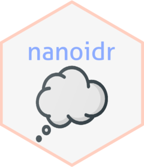

<!-- README.md is generated from README.Rmd. Please edit that file -->

```{r, include = FALSE}
knitr::opts_chunk$set(
  tidy = "styler",
  collapse = TRUE,
  comment = "#>",
  fig.path = "man/figures/README-",
  out.width = "100%"
)
pkgload::load_all()
```

# nanoidr <a href="https://paithiov909.github.io/nanoidr/" rel="noopener"></a>

<!-- badges: start -->
[](#)
<!-- badges: end -->

[ai/nanoid](https://github.com/ai/nanoid) is a tiny, secure, URL-friendly, unique string ID generator for JavaScript. The nanoidr package is an R port of NanoID.

The original NanoID library generates random strings using crypto API, which is replaced with `openssl::rand_bytes` in nanoidr package.
See also [Generating Secure Random Numbers in R](https://cran.r-project.org/web/packages/openssl/vignettes/secure_rng.html) for more details about `openssl::rand_bytes`.

## Installation

``` r
remotes::install_github("paithiov909/nanoidr")
```

## Usage

```{r usage}
## Basic usage.
nanoidr::nanoid()
## You can use your own random number generator.
nanoidr::nanoid(29, func = function(size) {
  runif(size, 0, 255)
})
```

## Alternatives

- [hrbrmstr/nanoid: Tools to Generate Short, Secure, URL-friendly, and Unique String Identifiers](https://github.com/hrbrmstr/nanoid)
- [reside-ic/ids: :information_source: Simple random identifiers](https://github.com/reside-ic/ids)
- [sqids/sqids-r: Official R port of Sqids. Generate short unique IDs from numbers.](https://github.com/sqids/sqids-r)
- [stri_rand_strings: Generate Random Strings - R Package stringi](https://stringi.gagolewski.com/rapi/stri_rand_strings.html)
- [random_strings: random_strings in stringfish: Alt String Implementation](https://rdrr.io/cran/stringfish/man/random_strings.html)

## License

MIT license.

Icon made by [Those Icons](https://www.flaticon.com/authors/those-icons) from [www.flaticon.com](https://www.flaticon.com/).
