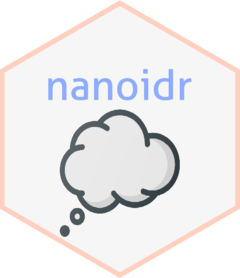

<!-- README.md is generated from README.Rmd. Please edit that file -->

# nanoidr 

<!-- badges: start -->

[](#)
[](https://github.com/paithiov909/nanoidr/blob/master/LICENSE)

<!-- badges: end -->

> NanoID on V8 for R

## What is {nanoidr}?

[ai/nanoid](https://github.com/ai/nanoid) is a tiny (137 bytes), secure,
URL-friendly, unique string ID generator for JavaScript. The {nanoidr}
package is a pseudo R wrapper of NanoID library running on [V8 for
R](https://github.com/jeroen/V8).

## Disclaimer

> The original NanoID library generates random strings with
> window.crypto.getRandomValues on client side environment, however, the
> V8 environment provides no window.crypto object. Because of this,
> {nanoidr} package replaces that function with a simple wrapper of
> `openssl::rand_bytes()`.

So that V8 environment has no crypto API, behaivors between {nanoidr}
and the original NanoID library may be different in details. See also
[Generating Secure Random Numbers in
R](https://cran.r-project.org/web/packages/openssl/vignettes/secure_rng.html)
for more details about `openssl::rand_bytes()`.

## Related repositories

  - [ai/nanoid](https://github.com/ai/nanoid) The original NanoID
    library.
  - [CyberAP/nanoid-dictionary](https://github.com/CyberAP/nanoid-dictionary)
    Predefined character sets to use with nanoid.
  - [y-gagar1n/nanoid-good](https://github.com/y-gagar1n/nanoid-good)
    Obscene words filter for nanoid.
  - [jeroen/V8](https://github.com/jeroen/V8) Embedded JavaScript engine
    for R.

Seeking more alternatives? These packages may help you.

  - [richfitz/ids](https://github.com/richfitz/ids) A cool way for you
    to simply generate random identifiers.
  - [ALShum/hashids-r](https://github.com/ALShum/hashids-r) R
    implementation of [Hashids](https://hashids.org/r/).

## Installation

``` r
remotes::install_github("paithiov909/nanoidr")
```

## How to use

### Common use case

``` r
nano <- nanoidr::nanoid()
nano$generate() # the simplest use case
#> [1] "cLF-mt0f9WiMozMMBE5a9"
nano$generate(size = 13L, dict = "numbers") # generate from built in pattern
#> [1] "5709273229949"
nano$generate(size = 16L, dict = "You can use any strings as dictionary!!")
#> [1] "r  inyygasd u ss"
nano$generate(size = 16L, dict = "マルチバイト文字を使っても動作します", init.locales = "ja")
#> [1] "ルっをル字字をっ動作を文トっまバ"
nano$nonsecure(size = 27L) # use faster but non-secure version
#> [1] "WjXEc-LIFTZi5UAfuTs_gSx_d8H"
```

### Using custom random bytes generator

``` r
myRndBytesFunc <- function(size) {
  sapply(1:size, function(i) {
    abs(floor(dqrng::dqrnorm(1, 0, 64)))
  })
}
nano$format(size = 38L, use_func = "myRndBytesFunc")
#> [1] "CR8RkOJQ4XuyMJxDNedlwYJhrUa5a7q24TPLta"
```

### Customizing and reusing V8 context

``` r
nano <- nanoidr::nanoid()
mycontext <- nano$ctx
mycontext$source("another_awesome_source.js")
nano2 <- nanoidr::nanoid(ctx = mycontext)
```

## Code of Conduct

Please note that the nanoidr project is released with a [Contributor
Code of
Conduct](https://paithiov909.github.io/nanoidr/CODE_OF_CONDUCT.html). By
contributing to this project, you agree to abide by its terms.

## License

Copyright (c) 2019 Kato Akiru

Released under the MIT license
<https://github.com/paithiov909/nanoidr/blob/master/LICENSE>

Icon made by [Those Icons](https://www.flaticon.com/authors/those-icons)
from [www.flaticon.com](https://www.flaticon.com/)
